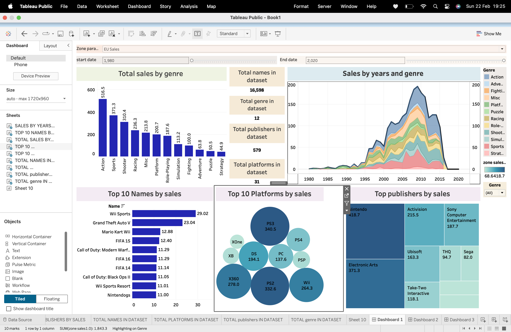

# video-game-sales-Analysis
Interactive Tableau dashboard analyzing video game sales trends

🎮 Video Game Sales Analysis Dashboard
📊 Project Overview:
This project presents an interactive Tableau dashboard analyzing global video game sales data from 1980–2020.
The goal is to identify key revenue drivers, market trends, and performance patterns across genres, platforms, and publishers using KPI-driven visualizations.

📈 Key Insights & Features:
📌 Total Global Sales KPI
📌 Total Games, Genres, Publishers & Platforms
📌 Year Range Filter (1980–2020)
📊 Sales by Genre
📊 Sales Trends Over Time
🏆 Top 10 Games by Sales
🎮 Platform Performance Comparison
🏢 Publisher Revenue Distribution
The dashboard allows interactive filtering to explore historical trends and market performance.

🛠 Tools Used:
Tableau Public
CSV Dataset
Data Visualization Techniques

💼 Skills Demonstrated:
Data Visualization
KPI Design
Business Intelligence
Trend Analysis
Dashboard Development

